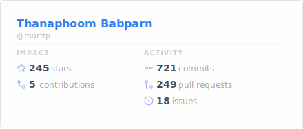
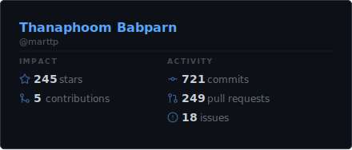
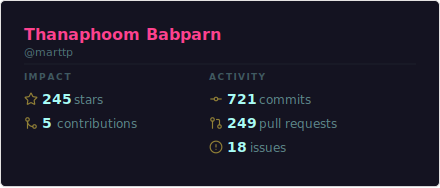
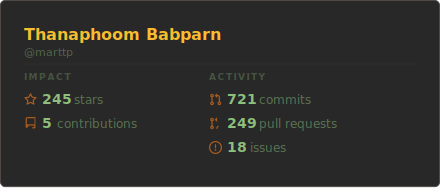
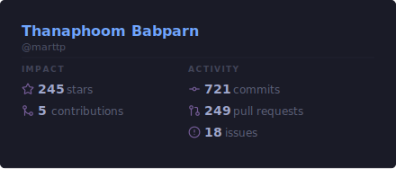
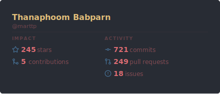
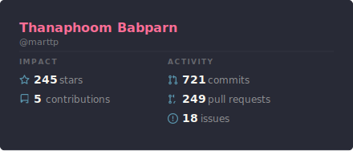
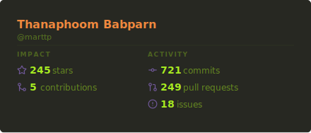
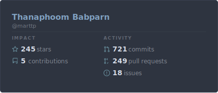
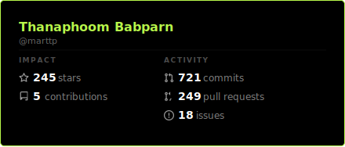

# GitHub Stats Creator

A GitHub Action that generates a clean, static SVG stats card from your GitHub profile and pushes it to your repository.

## Preview



## Features

- **Impact/Activity split**: Stars & contributions on the left, commits, PRs & issues on the right
- **10 themes**: default, dark, radical, gruvbox, tokyonight, onedark, dracula, monokai, nord, highcontrast
- **Self-contained**: No external services — runs entirely inside the Action
- **Auto-detects user**: Defaults to the repository owner
- **Static SVG**: No animations or CSS — renders consistently as a static image

## Quick Start

```yaml
name: Update GitHub Stats

on:
  schedule:
    - cron: "0 0 * * *"
  workflow_dispatch:

jobs:
  stats:
    runs-on: ubuntu-latest
    permissions:
      contents: write
    steps:
      - uses: actions/checkout@v4

      - name: Generate stats card
        uses: marttp/github-stats-creator@v1
        with:
          github_token: ${{ secrets.GITHUB_TOKEN }}
```

Then embed in your README:

```markdown

```

## Inputs

| Input | Description | Required | Default |
|-------|-------------|----------|---------|
| `github_user_name` | GitHub username. Defaults to the repository owner. | No | `""` (auto-detected) |
| `github_token` | GitHub token (PAT or `GITHUB_TOKEN`). Needs `read:user` scope. | Yes | `${{ github.token }}` |
| `theme` | Theme preset (see below) | No | `default` |
| `output_path` | Output file path for the SVG | No | `gh-stats.svg` |
| `commit_message` | Git commit message when pushing the SVG | No | `Update GitHub stats SVG [skip ci]` |
| `show_icons` | Show icons on the stats card | No | `true` |
| `include_all_commits` | Include all-time commits (uses REST API, may be slower) | No | `false` |

## Outputs

| Output | Description |
|--------|-------------|
| `svg_path` | Path to the generated SVG file |

## Themes

| Theme | Preview |
|-------|---------|
| `default` |  |
| `dark` |  |
| `radical` |  |
| `gruvbox` |  |
| `tokyonight` |  |
| `onedark` |  |
| `dracula` |  |
| `monokai` |  |
| `nord` |  |
| `highcontrast` |  |

## Permissions

The workflow requires `contents: write` permission to commit and push the SVG file.

## Token Scopes

- **Public repos**: `GITHUB_TOKEN` (default) works out of the box
- **Private repos** or `include_all_commits`: use a PAT with `repo` and `read:user` scopes

## License

MIT
